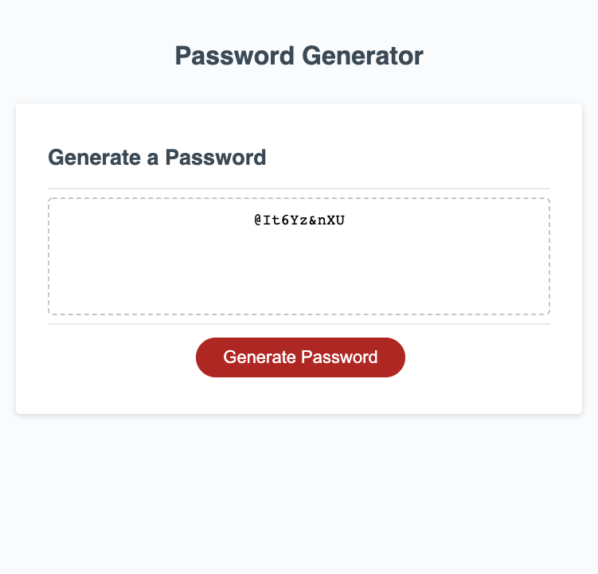

# random-password-generator

## Description

This webpage will allow the user to generate a random password. This password is going to be between 8-128 and will include special characters, uppercase, lowercase, and/or numbers based upon the user's preferences. 

The user will click the "generate password" button and will be prompted by the page to input their desired password length. If the borrower inputs a number that is less than 8 or greater than 128 characters, the user will receive an alert that the password must be between 8-128 characters. If the borrower inputs something other than a number they will be alerted that their input must be a number. After the user inputs a number there will be a series of messages asking the types of characters the borrower wants to have in their password. After this the borrower will then have their random password generated for them. 

## Installation

This webpage can be accessed at ryanmbelcher.github.io/random-password-generator

## Usage

## Credits

Dominique Clarke was a great help in getting me to logically think thorugh this. As well as numerous classmates-- Justin, Josh, Eric, Leon all shared information that helped greatly in getting my mind going in the right direction.  

## License

MIT License

Copyright (c) 2022 RyanMBelcher

Permission is hereby granted, free of charge, to any person obtaining a copy
of this software and associated documentation files (the "Software"), to deal
in the Software without restriction, including without limitation the rights
to use, copy, modify, merge, publish, distribute, sublicense, and/or sell
copies of the Software, and to permit persons to whom the Software is
furnished to do so, subject to the following conditions:

The above copyright notice and this permission notice shall be included in all
copies or substantial portions of the Software.

THE SOFTWARE IS PROVIDED "AS IS", WITHOUT WARRANTY OF ANY KIND, EXPRESS OR
IMPLIED, INCLUDING BUT NOT LIMITED TO THE WARRANTIES OF MERCHANTABILITY,
FITNESS FOR A PARTICULAR PURPOSE AND NONINFRINGEMENT. IN NO EVENT SHALL THE
AUTHORS OR COPYRIGHT HOLDERS BE LIABLE FOR ANY CLAIM, DAMAGES OR OTHER
LIABILITY, WHETHER IN AN ACTION OF CONTRACT, TORT OR OTHERWISE, ARISING FROM,
OUT OF OR IN CONNECTION WITH THE SOFTWARE OR THE USE OR OTHER DEALINGS IN THE
SOFTWARE.
